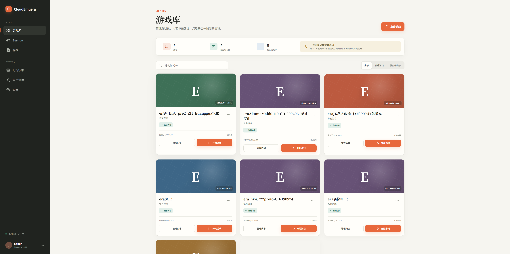
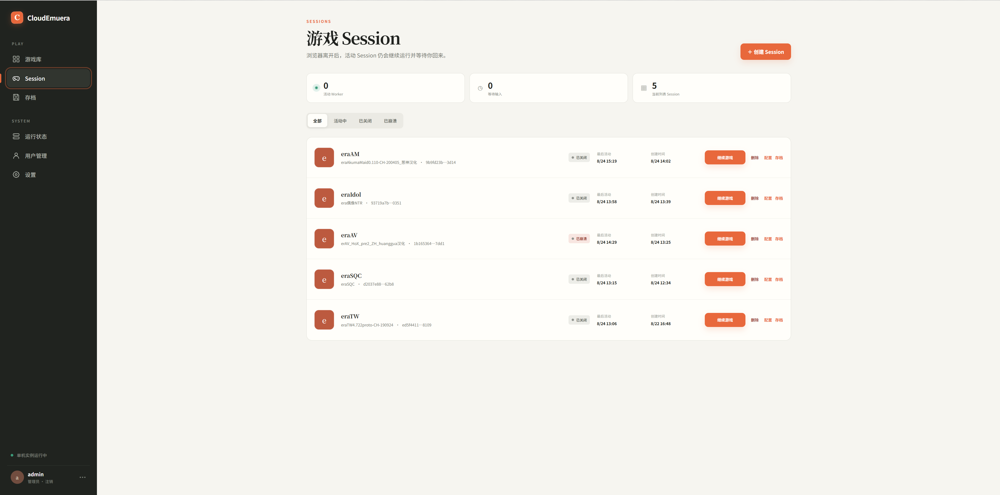
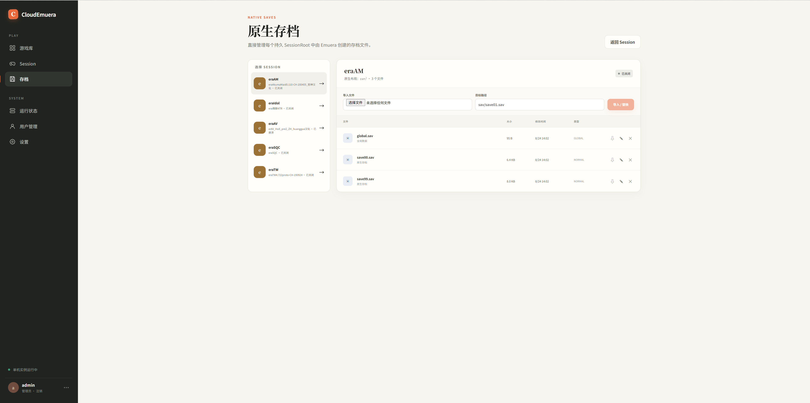
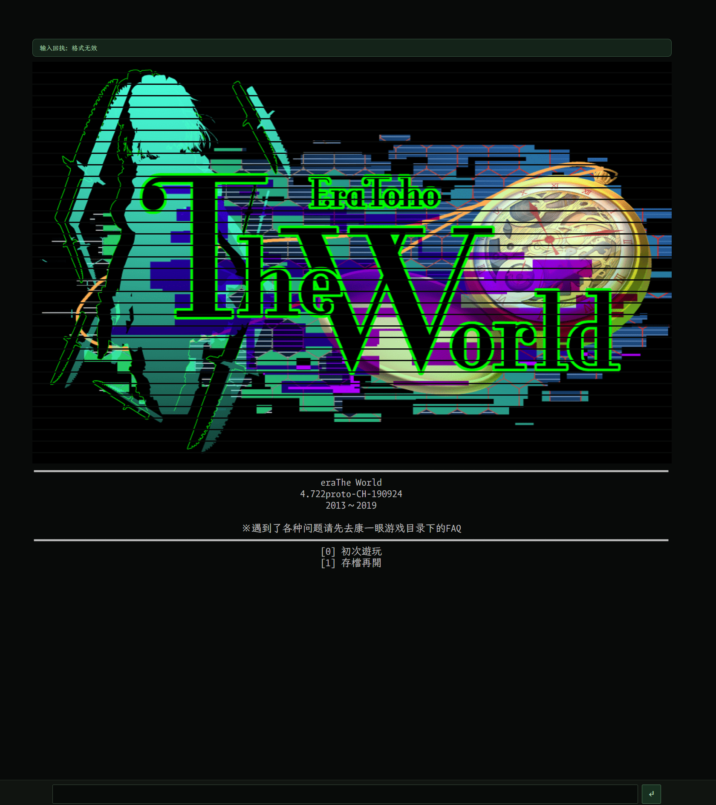
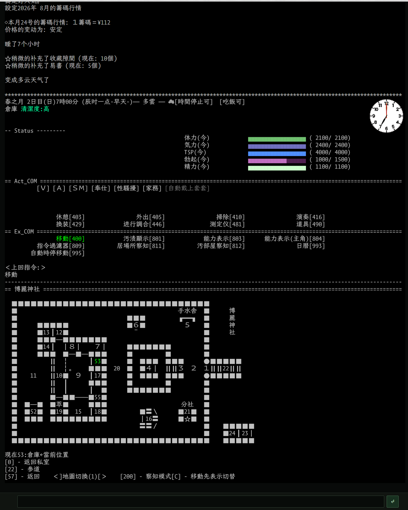

# CloudEmuera

CloudEmuera is a self-hosted browser platform for managing and playing Era games. Deploy it once, access it from any device, and continue your game with the same saves wherever you play.

## What is CloudEmuera?

CloudEmuera turns your Emuera game collection into a browser-playable game space. Each Session has its own running game and saves, so you can keep separate playthroughs and return to them later.

It is designed for people who want to run their own games on their own server, without installing a desktop game client on every device.

## What CloudEmuera provides

1. **Manage your entire Era game library** — Upload, validate, organize, and manage all your Era games in one place.
2. **Deploy once, play on any device** — Run CloudEmuera on your own server and play from a desktop, laptop, tablet, or phone.
3. **Share saves and continue anywhere** — Access the same native saves across devices and continue playing from where you left off.
4. **A near-native Emuera display** — Keep the familiar console-like presentation, with layouts optimized for desktop and mobile screens.
5. **Emuera compatibility** — Built for Emuera 1824+v18 games and the current Emuera.EM+EE compatibility baseline.

Sessions can be created, closed, reopened, and reconnected later. Multiple Sessions remain independent, and administrators can view basic Session status and stop a Session when needed.

## Product preview

The following screenshots show the main product views and the browser-based gameplay experience.

### Game library



### Sessions



### Save management



### Gameplay display



### Gameplay map



## Deploy once with Docker

CloudEmuera runs as a single Docker Compose service. You need Docker 28+ and Docker Compose v2.

### First deployment

From the repository root, create the production environment file:

```bash
cd docker
cp .env.example .env
```

Edit `.env` and set the first administrator account before starting the service:

```dotenv
CLOUDEMUERA_BOOTSTRAP_ADMIN_USERNAME=admin
CLOUDEMUERA_BOOTSTRAP_ADMIN_EMAIL=you@example.com
CLOUDEMUERA_BOOTSTRAP_ADMIN_PASSWORD=change-this-password
```

Start CloudEmuera:

```bash
docker compose up -d --build
```

Open `http://127.0.0.1:28647` on the server and log in with the account configured above. The default data is kept in the managed Docker volume `cloudemuera-data`.

### Access from other devices

For devices on the same network, edit `.env`:

```dotenv
CLOUDEMUERA_HTTP_BIND_ADDRESS=0.0.0.0
```

Apply the change and open `http://<server-address>:28647` from another device:

```bash
docker compose up -d
```

For an internet-facing deployment, keep `CLOUDEMUERA_HTTP_BIND_ADDRESS=127.0.0.1`, put an HTTPS reverse proxy in front of CloudEmuera, and set:

```dotenv
CLOUDEMUERA_SECURITY_SECURE_COOKIES=true
```

After the first login, change the temporary password. To update the deployment later, run `docker compose up -d --build` from the `docker/` directory again.

## Project status

CloudEmuera is in standalone MVP release preparation. It is intended for self-hosted instances and trusted game packages; do not expose the current build to untrusted users or the public internet.

## License

CloudEmuera's original code is licensed under the [Apache License 2.0](LICENSE). Emuera.EM+EE and other bundled components retain their original licenses; see [NOTICE](NOTICE) and [THIRD_PARTY_NOTICES.md](THIRD_PARTY_NOTICES.md).
